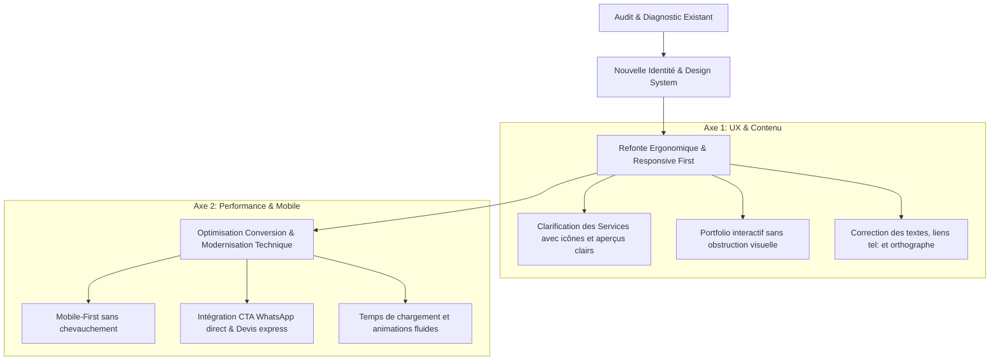

# 🎯 Rapport d'Investigation & Audit UI/UX — Kreativ'Pulse
**URL du site audité :** [https://kreativpulse.net/](https://kreativpulse.net/)  
**Contexte :** Projet de stage académique — Préparation de la proposition de refonte web.

---

## 1. 🔍 Synthèse Exécutive

Le site de **Kreativ'Pulse** possède une réelle base d'identité visuelle (thématique sombre « dark mode », dynamisme de l'orange `#E88314`, présence d'animations et de réalisations concrètes).  
Cependant, l'exploration et l'audit UI/UX révèlent de **nombreux dysfonctionnements majeurs**, tant au niveau ergonomique (UX), visuel (UI), responsive mobile qu'au niveau des contenus et de la conversion commerciale.

> [!IMPORTANT]
> Pour un stage académique, ce diagnostic est une **opportunité idéale** : vous disposez d'éléments concrets, factuels et mesurables à présenter à votre maître de stage pour justifier la pertinence d'une refonte complète ou d'une modernisation poussée.

---

## 2. 🌟 Ce qui va bien (Points Forts & Acquis)

1. **Direction artistique et charte graphique affirmée** :
   - Le contraste entre le noir profond et l'orange vif reflète bien le positionnement d'une agence créative et technologique.
   - Les boutons avec flèche diagonale `↗` apportent une touche moderne et dynamique.
2. **Arborescence claire** :
   - Présence des pages essentielles : *Accueil*, *L'agence*, *Nos prestations*, *Nos réalisations*, *Contact*, et *Demande de devis*.
3. **Formulaire de devis structuré** :
   - La page `/demande-de-devis/` permet déjà de qualifier le besoin (sélection de prestations, budget, délai).
4. **Crédibilité & Ancrage local** :
   - Mise en avant de plus de 10 ans d'existence et de clients/partenaires institutionnels sénégalais réputés (UCG, COSEC, FHS, Gsef, etc.).

---

## 3. 🚨 Ce qui ne va pas (Points Faibles & Anomalies Critiques)

### 3.1. Expérience Utilisateur (UX) & Ergonomie

| Problème UX | Observation / Preuve | Impact Utilisateur | Gravité |
| :--- | :--- | :--- | :---: |
| **Section Services vide / illisible** | Sur la page d'accueil (*"Nos services exclusifs"*), les 4 blocs I, II, III, IV n'affichent **aucun titre visible** dans le flux normal. Seuls les chiffres romains géants apparaissent. | L'utilisateur ne sait absolument pas ce que vend l'agence sans devoir survoler ou deviner. Perte immédiate d'intérêt. | 🔴 Critique |
| **Lien d'appel d'urgence cassé** | Sur la page `/contact/`, le texte affiche `+221 33 825 09 09`, mais le lien `href` est un numéro de template fictif : `tel:3165550116` (indicatif US/Wichita). | Un prospect sur smartphone clique pour appeler et compose un faux numéro à l'étranger. Perte sèche de leads. | 🔴 Critique |
| **Bouton CTA masquant le texte (Mobile)** | En résolution smartphone (< 500px), le bouton orange *"NOS RÉALISATIONS"* se superpose directement sur le texte *"depuis dix ans."*. | Mauvaise première impression, sentiment de site "cassé" dès les 3 premières secondes. | 🔴 Critique |
| **Disparition des services sur Mobile** | En vue mobile, les cartes de services de la page d'accueil ne se chargent pas. Il y a un trou noir béant entre le titre et le bouton *"VOIR PLUS"*. | L'utilisateur mobile (qui représente souvent 70%+ du trafic au Sénégal) ne voit aucune offre. | 🔴 Critique |
| **Disque orange superposé sur le Portfolio** | Au centre de la grille de réalisations, un grand disque orange masque le centre de 4 projets. | Gêne visuelle, empêche d'apprécier la qualité du travail créatif de l'agence. | 🟠 Majeur |
| **Chevauchement Titre / Logos Partenaires** | Le bandeau noir *"CEUX QUI NOUS FONT CONFIANCE"* est collé par-dessus le premier logo partenaire sur la gauche. | Donne une impression de manque de finition pour une agence dont c'est le métier. | 🟠 Majeur |

---

### 3.2. Interface Visuelle (UI) & Typographie

1. **Hiérarchie visuelle du Hero** :
   - Le texte géant `KREATIV PULSE` prend énormément de place verticale, tandis que la proposition de valeur (*qui nous sommes, ce que nous apportons au client*) est relayée en petits caractères en bas à gauche.
2. **Coquilles orthographiques visibles dès le premier regard** :
   - Bouton de présentation : **« En savoirs plus »** (faute de grammaire avec un 's' inutile).
   - Accents manquants ou erronés : *« 10+ ANNÉES D'EXPERIENCES »* (au lieu de *« D'EXPÉRIENCES »*), *« Sénegalais »* (au lieu de *« Sénégalais »*).
3. **Résidus de code / slugs visibles pour l'utilisateur** :
   - Dans le workflow, on lit textuellement : `ETAPE_01`, `ETAPE_02`, `ETAPE_03`, `ETAPE_04` avec les underscores de variables techniques.
4. **Erreur de copier-coller de contenu** :
   - L'étape 04 (*Lancer Et Développer*) affiche la même description que l'étape 03 (*Test Et Optimisation*) : *"Nous testons rigoureusement chaque aspect de votre projet afin de garantir sa perfection."*

---

### 3.3. Performance & Conversion (CRO)

- **Manque de micro-interactions subtiles** : Les transitions sont saccadées ou reposent sur des scripts lourds de thème WordPress sans optimisation.
- **Formulaire de contact trop basique** : Manque d'indicateurs rassurants (délai moyen de réponse, politique de confidentialité, badge WhatsApp direct très prisé au Sénégal).
- **Navigation mobile perfectible** : Le menu hamburger affiche une liste standard sans mise en valeur des actions prioritaires (*Demander un devis* ou *WhatsApp*).

---

## 4. 🗺️ Proposition Stratégique pour votre Refonte (Feuille de Route)

Dans le cadre de votre stage académique, voici le plan en 4 axes que vous pouvez présenter :

### Étape 1 : Quick Wins Immédiats (Pour montrer votre impact dès maintenant)
1. Corriger le lien `tel:` sur la page contact pour pointer vers le standard de l'agence.
2. Corriger la coquille *"En savoirs plus"* et les étapes de workflow (`ETAPE_01` -> `01. Découverte`).
3. Ajuster le CSS du Hero mobile pour supprimer le chevauchement du bouton.

### Étape 2 : Le Grand Chantier de Refonte (Votre sujet de stage)
1. **Design System moderne** :
   - Conserver la signature Noir/Orange mais adopter un style plus "Bento Grid" ou "Glassmorphism", très tendance pour les agences digitales internationales.
   - Typographie soignée (ex. *Plus Jakarta Sans*, *Outfit* ou *Sora* pour les titres tech/créatifs).
2. **Architecture de l'information repensée** :
   - Rendre les 4 piliers (Digital, Goodies & Print, Audiovisuel/Multimedia, Événementiel) interactifs et immédiatement compréhensibles dès la page d'accueil.
   - Galerie de réalisations avec filtres par catégorie, études de cas avec métriques (ex: *"Augmentation de +40% de visibilité"*).
3. **Optimisation pour le marché local (Sénégal & Afrique de l'Ouest)** :
   - Bouton flottant WhatsApp interactif (levier n°1 de conversion en B2B local).
   - Preuve sociale forte : avis clients sous forme de cartes modernes, logos partenaires animés en carrousel infini fluide (*marquee*).
